# Spring-boot + Git + Jenkins + Docker

[war로 배포](https://www.youtube.com/watch?v=6fcoYGqvg6o)
[gradle](https://hyeinisfree.tistory.com/23)
[maven pipeLine](https://nyyang.tistory.com/113)

1. Jenkins에 아이템 생성
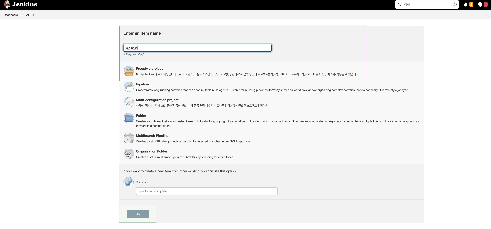
2. 소스 코드 관리에 Git 소스 연동
   - Credentials 에 비밀번호 인증은 더이상 지원되지 않으니 꼭 `PAT`이나 `SSH` 사용 권장
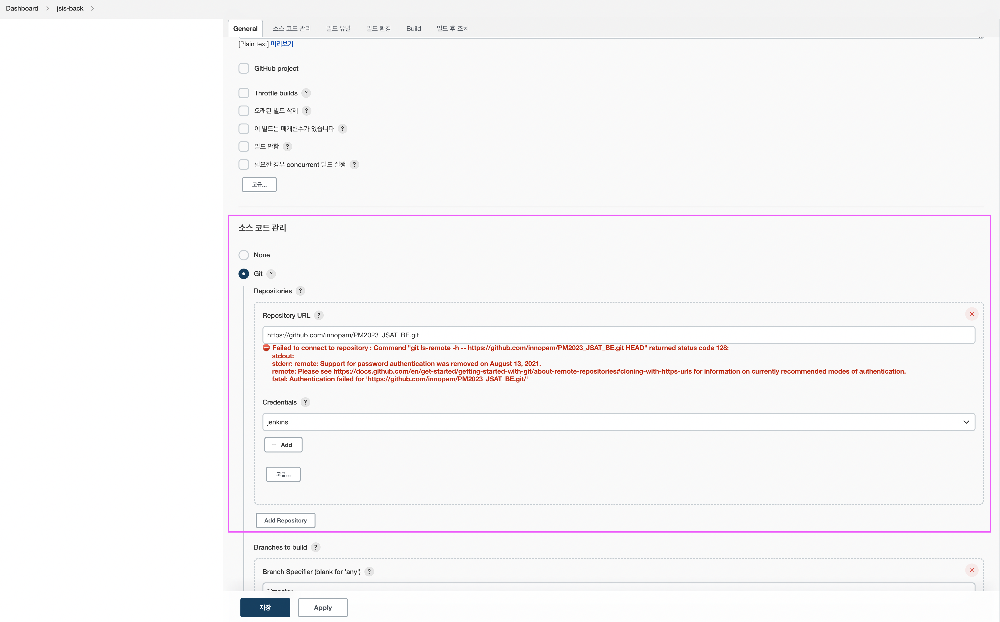
   - 회사에선 현재 아래것 사용이 권장
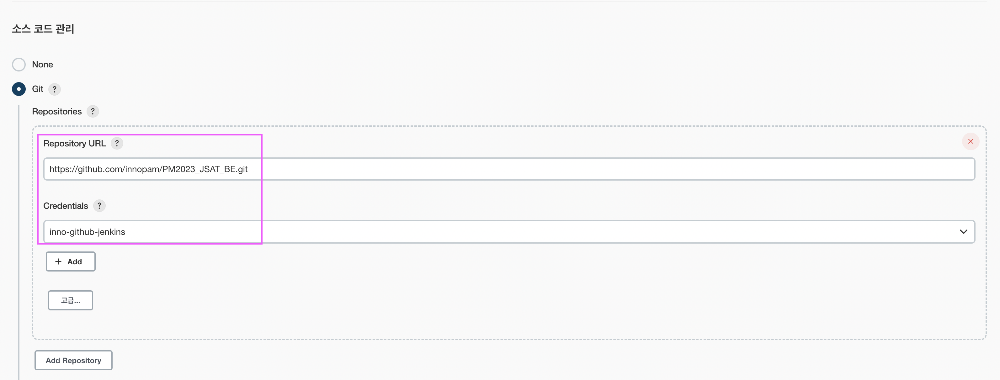
3. build trigger 설정
   - `GitHub hook trigger for GITScm polling` : 이 옵션은 GitHub에서 webhook을 사용하여 빌드를 트리거합니다. GitHub에서 새로운 커밋이나 풀 리퀘스트가 발생할 때마다 Jenkins가 알림을 받아 빌드를 트리거하게 됩니다.
   - `Poll SCM` : Jenkins에게 소스 코드 관리(SCM) 시스템을 주기적으로 확인하도록 지시하며, 변경사항이 있을 경우 빌드를 트리거합니다.
   - 나는 GitHub hook을 하지 못함
     - 권한이 없어서 못함
   - poll-scm을 할 스케쥴 타임 설정
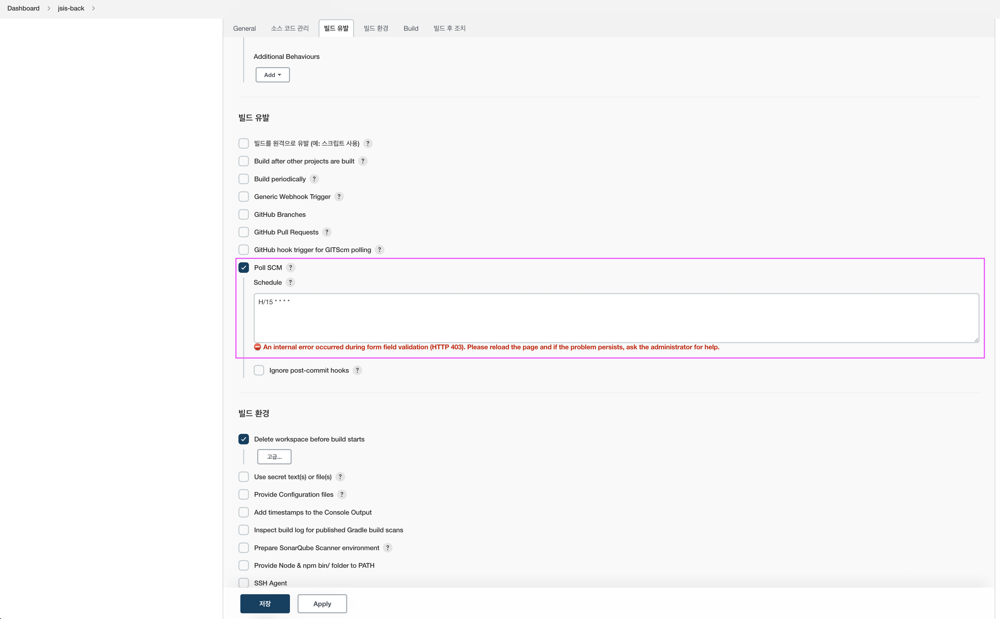
4. build enviromnet 설정
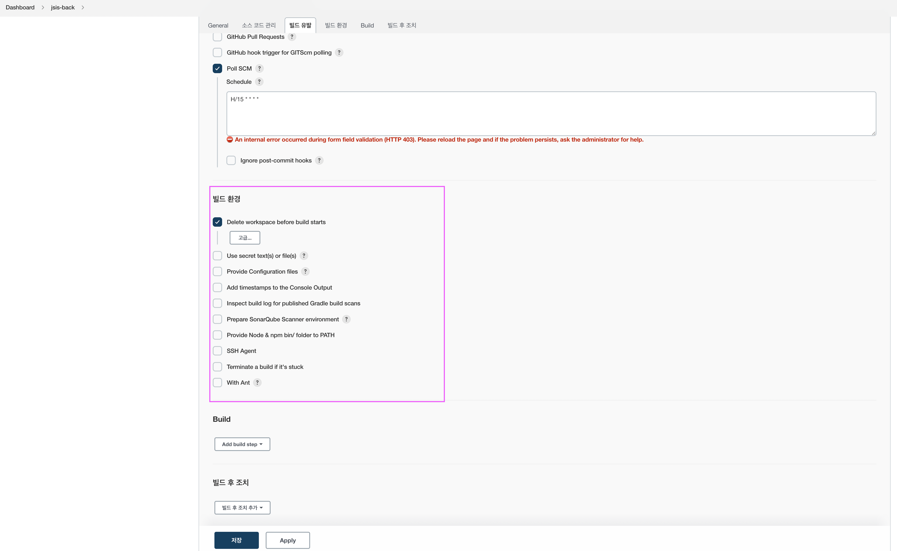
5. build 툴과 방법 선택
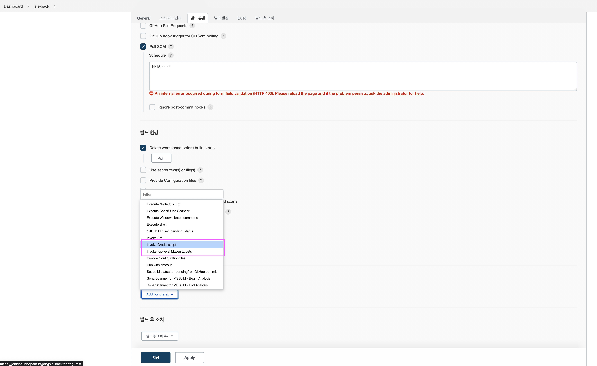
6. 빌드 후 조치 실패
   - 빌드 후 컨테이너에 배포하는 선택사항이 있어야 하는데 이가 없다
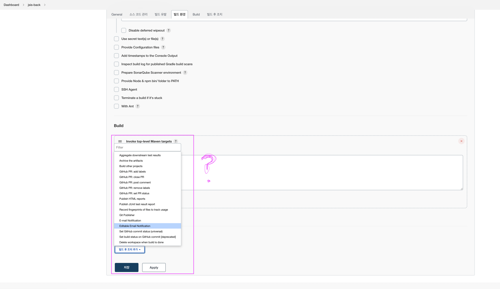
7. deploy to container plugin 설치
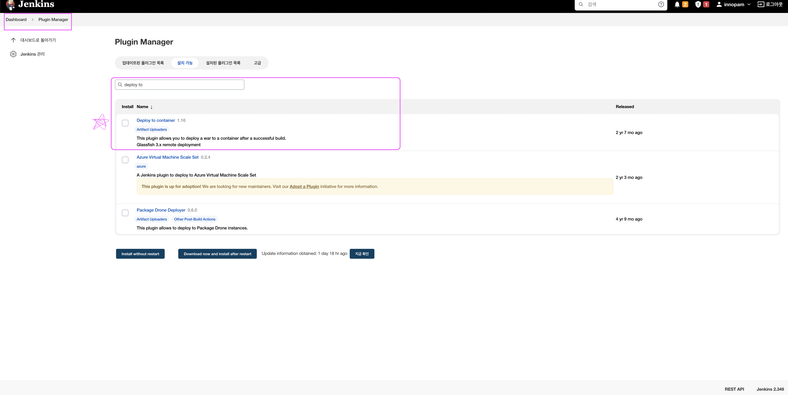
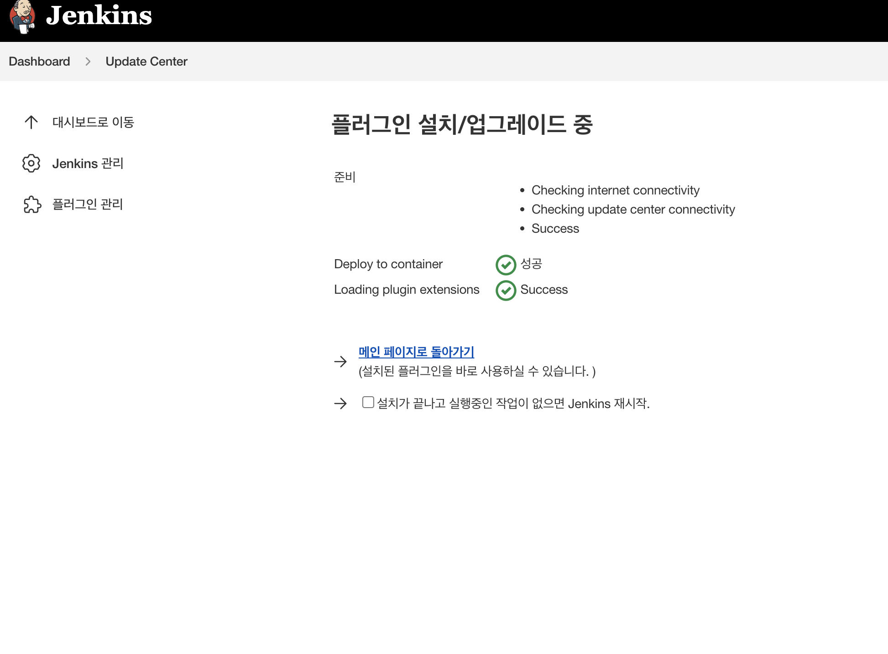     
8. 망함 🌚


1. Git -> main 브랜치에서 Push 이벤트가 발생하면 Webhook이 발생한다.
2. Webhook은 Jenkins 서버에게 POST로 날린다.
3. Jenkins는 기 설정된 Trigger 조건(Github hook trigger for GITScm polling)에 의거하여 Trigger가 되며, Jenkins Pipeline을 수행하게 된다.
4. Jenkins 서버 내에서 Pipeline에 정의된 대로 작업들을 수행한다.
   1) Git Checkout (소스 코드를 받아온다.)
   2) Maven으로 Springboot 프로젝트를 Build하여 JAR 파일로 떨군다.
   3) Docker를 이용하여 Image 파일로 생성하고, ECR 컨테이너 레지스트리로 Push한다.


1. 빌드 실패 

```
env.PROJECT_NAME = "secret
env.TARGET_BRANCH = "secret"
env.TARGET_HOST = "secret"
env.TARGET_WORKDIR="secret"

node {
    try {
        stage('Clone'){
            echo 'Checkout' + env.TARGET_BRANCH
            git branch: env.TARGET_BRANCH, credentialsId:'github_access', url:'https://github.com/innopam/PM2023_JSAT_BE.git'
        }
        stage('Build and Test'){
            sh 'mvn clean install'
        }
        stage('Deploy') {
            sshagent (credentials: ['master-key-ssh']) {
                sh """
                    ssh -o StrictHostKeyChecking=no ${env.TARGET_HOST} "cd ${env.TARGET_WORKDIR} && java -jar target/innopam_jsat-1.0.0.jar"
                """
            }
        }
    } catch (Exception e) {
        // notifyMSTeams('FAIL')
        echo 'error = ' + e
        throw e
    }
}

```

2. 시도중

```
pipeline {
    agent any

    tools {
      // Jenkins 'Global Tool Configuration' 에 설정한 버전과 연동
      maven 'apache-maven-3.8.1'
    }

    environment {
        //ECR_PATH = '{YOUR-ACCOUNT-NUMBER}.dkr.ecr.ap-northeast-2.amazonaws.com'
        //ECR_IMAGE = 'demo-maven-springboot'
        //REGION = 'ap-northeast-2'
        //ACCOUNT_ID='{YOUR-ACCOUNT-NUMBER}'
        PROJECT_NAME = "secret
        TARGET_BRANCH = "secret"
        TARGET_HOST = "secret"
        TARGET_WORKDIR="secret"
    }

    stages {
        stage('Git Clone from gitSCM') {
            steps {
                script {
                    try {
                        git branch: 'main', 
                            credentialsId: 'github_access',
                            url: 'https://github.com/innopam/PM2023_JSAT_BE'
                        sh "ls -lat"
                        sh "sudo rm -rf ./.git"
                        env.cloneResult=true
                    } catch (error) {
                        print(error)
                        env.cloneResult=false
                        currentBuild.result = 'FAILURE'
                    }
                }
            }
        }
        stage("Build JAR with Maven") {
            when {
                expression {
                    return env.cloneResult ==~ /(?i)(Y|YES|T|TRUE|ON|RUN)/
                }                
            }
            steps {
                script{
                    try {
                        sh """
                        rm -rf deploy
                        mkdir deploy
                        mvn --version
                        java -version
                        """
                        sh "sed -i 's/  version:.*/  version: \${VERSION:v${env.BUILD_NUMBER}}/g' /var/lib/jenkins/workspace/${env.JOB_NAME}/src/main/resources/application.yaml"
                        sh "cat /var/lib/jenkins/workspace/${env.JOB_NAME}/src/main/resources/application.yaml"
                        sh 'mvn -e -Dmaven.test.failure.ignore=true clean install'
                        sh """
                        cd deploy
                        cp /var/lib/jenkins/workspace/${env.JOB_NAME}/target/*.jar ./${ECR_IMAGE}.jar
                        """
                        env.mavenBuildResult=true
                    } catch (error) {
                        print(error)
                        echo 'Remove Deploy Files'
                        sh "sudo rm -rf /var/lib/jenkins/workspace/${env.JOB_NAME}/*"
                        env.mavenBuildResult=false
                        currentBuild.result = 'FAILURE'
                    }
                }
            }
        }
        stage('Docker Build and Push to ECR'){
            when {
                expression {
                    return env.mavenBuildResult ==~ /(?i)(Y|YES|T|TRUE|ON|RUN)/
                }
            }
            steps {
                script{
                    try {
                        sh"""
                        #!/bin/bash
                        cat>Dockerfile<<-EOF
                        FROM openjdk:11-jre-slim
                        ENV JAVA_OPTS="-XX:InitialRAMPercentage=40.0 -XX:MaxRAMPercentage=80.0"
                        ADD ./deploy/${ECR_IMAGE}.jar /home/${ECR_IMAGE}.jar
                        CMD nohup java -jar /home/${ECR_IMAGE}.jar 1> /dev/null 2>&1
                        EXPOSE 8080
                        EOF"""
                        docker.withRegistry("https://${ECR_PATH}", "ecr:${REGION}:AWSCredentials") {
                            def image = docker.build("${ECR_PATH}/${ECR_IMAGE}:${env.BUILD_NUMBER}")
                            image.push()
                        }
                        
                        echo 'Remove Deploy Files'
                        sh "sudo rm -rf /var/lib/jenkins/workspace/${env.JOB_NAME}/*"
                        env.dockerBuildResult=true
                    } catch (error) {
                        print(error)
                        echo 'Remove Deploy Files'
                        sh "sudo rm -rf /var/lib/jenkins/workspace/${env.JOB_NAME}/*"
                        env.dockerBuildResult=false
                        currentBuild.result = 'FAILURE'
                    }
                }
            }
        }
    }
}

```

FROM openjdk:17
EXPOSE 8080
ADD build/libs/git-action-repository.jar git-action-repository.jar
ENTRYPOINT ["java","-jar","git-action-repository.jar"]

```text
pipeline {
    agent { docker { image 'maven:3-alpine' } }
    stages {
        stage('Build') {
            steps {
                sh 'mvn -B -DskipTests clean package'
            }
        }
        stage('Test') {
            steps {
                sh 'mvn test'
            }
        }
        stage('Deploy') {
            steps {
                sh '''
                docker build -t my-app .
                docker run -d -p 8080:8080 my-app
                '''
            }
        }
    }
}
```


3. 로컬에서는 성공
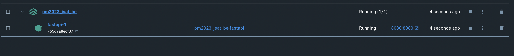
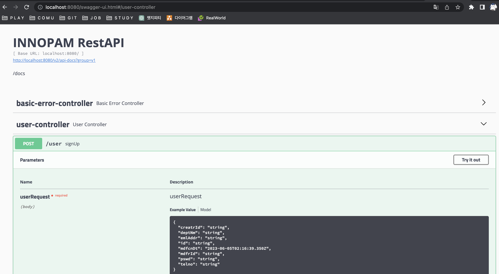

```dockerfile
# 빌드 스테이지
FROM maven:3.8.1-jdk-11 as build
WORKDIR /app
COPY . /app
RUN mvn clean package
RUN mvn -B -f pom.xml clean package -DskipTests

# 실행 스테이지
FROM openjdk:11-jre-slim
WORKDIR /app
COPY --from=build /app/target/innopam_jsat-1.0.0.jar /app/
EXPOSE 8080
CMD ["java", "-jar", "/app/innopam_jsat-1.0.0.jar"]
```
```docker
version: "3.7"

services:
  fastapi:
    build:
      context: ./ # 도커파일이 위치한 위치
      dockerfile: Dockerfile # 도커파일 이름
    # command: python3 index.py
    ports:
      - 8080:8080
```

